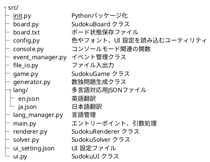
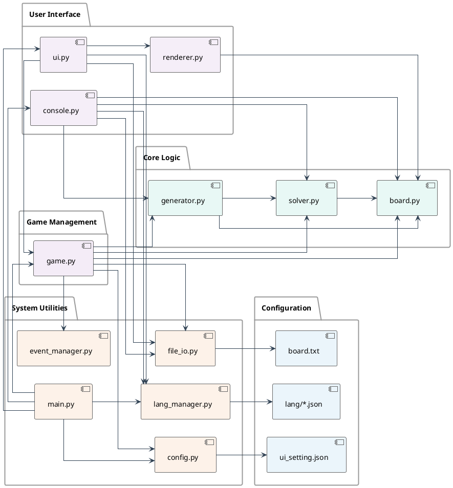

# 数独ソルバー 設計概要

## 1. src/ ディレクトリのファイル構成



---

## 2. ファイルの責務分担

### コアロジック
- `board.py`
  - `SudokuBoard` クラスを提供
  - 数独の盤面状態の管理
  - マス目の値の設定・取得
  - 行・列・ブロックの値の検証

- `solver.py`
  - `SudokuSolver` クラスを提供
  - バックトラッキングによる数独の解法ロジック
  - 解の存在チェックと解の導出

- `generator.py`
  - `SudokuGenerator` クラスを提供
  - ランダムな数独問題の生成
  - 難易度に応じた問題の調整

### ゲーム管理
- `game.py`
  - `SudokuGame` クラスを提供
  - ゲームの状態管理（初期化、実行中、一時停止、終了など）
  - プレイヤーの操作履歴の管理
  - ゲームルールの適用と勝利条件の判定

### UI 関連
- `ui.py`
  - `SudokuUI` クラスを提供
  - メインのグラフィカルユーザーインターフェース
  - マウス・キーボード入力の処理
  - ゲーム画面の描画制御

- `renderer.py`
  - `SudokuRenderer` クラスを提供
  - 盤面の描画処理
  - アニメーションや視覚効果の実装

- `console.py`
  - コンソールモードでの実行に関する機能
  - コマンドライン引数の処理
  - テキストベースの盤面表示

### システム・ユーティリティ
- `main.py`
  - プログラムのエントリーポイント
  - 起動モード (GUI / コンソール) の切り替え
  - 初期化処理の統括

- `event_manager.py`
  - `EventManager` クラスを提供
  - イベントの発行・購読の管理
  - コンポーネント間の通信制御

- `config.py`
  - UI設定の読み込みと管理
  - 色やフォントなどの設定値の提供

- `file_io.py`
  - 盤面データの保存・読み込み
  - ファイルフォーマットの処理

- `lang_manager.py`
  - 多言語対応の管理
  - 翻訳テキストの読み込みと提供
  - 言語切り替え機能

### 設定・データファイル
- `ui_setting.json`
  - UIの設定値を定義
  - 色、フォント、サイズなどのカスタマイズ可能な値
  - 言語設定の管理

- `board.txt`
  - 盤面データの一時保存用ファイル
  - ゲーム状態のセーブ・ロード

- `lang/*.json`
  - 各言語の翻訳データ
  - テキスト文字列のキーと翻訳値の定義

- `__init__.py`
  - Pythonパッケージとして認識させるための空ファイル
  - モジュールのインポート管理

---

## 3. モジュール概要表

### コアロジック

| モジュール | 主要クラス | 主要メソッド | 依存モジュール |
|------------|------------|--------------|----------------|
| `board.py` | `SudokuBoard` | - `set_value(row, col, value)`<br>- `get_value(row, col)`<br>- `is_valid_move(row, col, value)`<br>- `is_original_cell(row, col)`<br>- `copy()` | - |
| `solver.py` | `SudokuSolver` | - `solve(animate, callback, speed, game)`<br>- `is_solvable()`<br>- `get_solution()` | `board.py` |
| `generator.py` | `SudokuGenerator` | - `generate(difficulty, progress_callback)`<br>- `create_filled_board()`<br>- `remove_numbers(count)` | `board.py`<br>`solver.py` |

### ゲーム管理

| モジュール | 主要クラス | 主要メソッド | 依存モジュール |
|------------|------------|--------------|----------------|
| `game.py` | `SudokuGame` | - `start_game()`<br>- `make_move(row, col, value)`<br>- `solve()`<br>- `generate_problem(difficulty)`<br>- `save_current_board(filepath)` | `board.py`<br>`solver.py`<br>`generator.py`<br>`event_manager.py`<br>`config.py`<br>`file_io.py` |

### UI 関連

| モジュール | 主要クラス | 主要メソッド | 依存モジュール |
|------------|------------|--------------|----------------|
| `ui.py` | `SudokuUI` | - `run()`<br>- `handle_event(event)`<br>- `draw_buttons()`<br>- `show_temporary_message(message, color)` | `game.py`<br>`renderer.py`<br>`file_io.py`<br>`lang_manager.py` |
| `renderer.py` | `SudokuRenderer` | - `draw_board()`<br>- `draw_cell(row, col)`<br>- `draw_speed_slider()`<br>- `set_selected_cell(row, col)` | `board.py`<br>`pygame` |
| `console.py` | - | - `print_board(board)`<br>- `run_console(input_file, verbose)`<br>- `generate_problems(count, difficulty, output_dir)` | `board.py`<br>`solver.py`<br>`generator.py`<br>`file_io.py`<br>`lang_manager.py` |

### システム・ユーティリティ

| モジュール | 主要クラス | 主要メソッド | 依存モジュール |
|------------|------------|--------------|----------------|
| `main.py` | - | - `main()`<br>- `parse_args()`<br>- `initialize_game()` | `game.py`<br>`ui.py`<br>`console.py`<br>`config.py`<br>`lang_manager.py` |
| `event_manager.py` | `EventManager` | - `subscribe(event_type, handler)`<br>- `publish(event_type, data)`<br>- `notify(event_type, data)` | - |
| `config.py` | - | - `load_ui_settings(filename)`<br>- `get_color(name)`<br>- `get_font(name)` | `json`<br>`os` |
| `file_io.py` | - | - `save_board_to_file(board, filename)`<br>- `load_board_from_file(filename)` | `lang_manager.py` |
| `lang_manager.py` | `LanguageManager` | - `get_text(section, key, default=None, *args)`<br>- `load_language(lang_code)`<br>- `get_language_manager(lang_code)` | `json`<br>`os` |

### 設定・データファイル

| ファイル | 形式 | 用途 | 依存モジュール |
|----------|------|------|----------------|
| `ui_setting.json` | JSON | - UI カラーテーマ<br>- フォント設定<br>- ウィンドウサイズ<br>- ボタン配置<br>- 言語設定 | `config.py` |
| `lang/*.json` | JSON | - 各言語の翻訳テキスト<br>- UIテキストや通知文字列の多言語化 | `lang_manager.py` |
| `board.txt` | テキスト | - 盤面データの保存<br>- ゲーム状態の保存 | `file_io.py` |
| `__init__.py` | Python | - パッケージ初期化<br>- インポート管理 | - |

---

## 4. 依存関係図



この依存関係図は以下の特徴を示しています：

1. コアロジック層
   - `board.py` が基盤となり、`solver.py` と `generator.py` がそれに依存
   - `generator.py` は `solver.py` も利用して問題生成を行う

2. ゲーム管理層
   - `game.py` がコアロジックとイベント管理を橋渡し
   - ゲームの状態管理とルール適用を担当

3. UI 層
   - `ui.py` が複数のコンポーネントを統合
   - `renderer.py` は描画に特化
   - `console.py` は最小限の依存関係

4. システムユーティリティ層
   - `main.py` がエントリーポイントとして各コンポーネントを統合
   - `event_manager.py` が疎結合なイベント通信を提供
   - `config.py` と `file_io.py` が外部ファイルとの連携を担当
   - `lang_manager.py` が多言語対応を提供

## 5. 多言語対応の実装

### 概要

多言語対応は `lang_manager.py` を中心に実装されており、言語リソースはJSON形式で管理しています。各言語ファイルはセクション別に整理され、キーと対応する翻訳テキストを持つ構造になっています。

### 言語設定の優先順位

1. コマンドライン引数（最優先）
2. 設定ファイル（`ui_setting.json`）
3. デフォルト言語（日本語）

### 言語リソースの構造

言語ファイル（例：`lang/ja.json`）は以下のような階層構造を持ちます：

```json
{
  "ui": {
    "window_title": "数独ソルバー",
    "buttons": {
      "solve": "解く",
      "reset": "リセット"
    },
    "messages": {
      "solved": "解答完了！",
      "invalid_input": "入力が無効です"
    }
  }
}
```

### 言語切り替えのプロセス

1. 起動時に `lang_manager.py` が初期化され、適切な言語ファイルが読み込まれます
2. `get_text()` 関数を使用してセクションとキーを指定し、対応する翻訳テキストを取得します
3. 翻訳テキスト中のプレースホルダー（`{0}`, `{1}` など）は、追加の引数で置換されます

### 新しい言語の追加方法

1. 既存の言語ファイル（`lang/ja.json` など）をテンプレートとして使用
2. 新しい言語ファイル（例：`lang/fr.json`）を作成し、すべてのテキストを翻訳
3. 設定ファイルの `language` 値を新しい言語コードに変更

